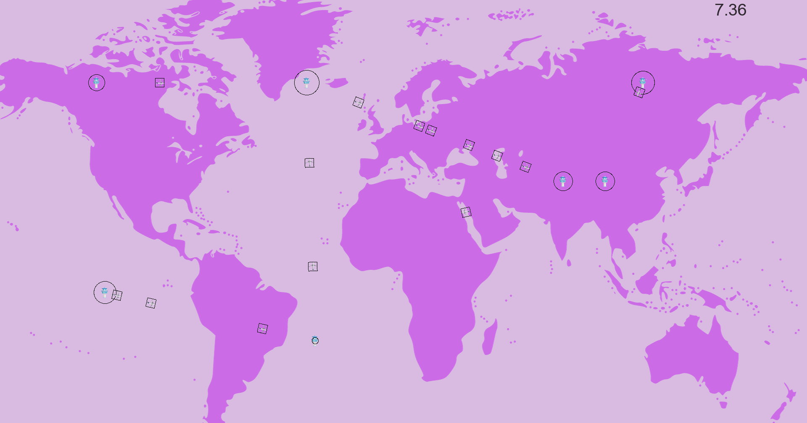

# Epitech's C Graphical Programming
Using CSFML library

Featuring:
- my_hunter: Small video game based on [Duck Hunt](https://en.wikipedia.org/wiki/Duck_Hunt) with Windows XP visuals.
- my_radar: 2D visualization panel showing a simulation of air traffic (AT).

## Gallery

