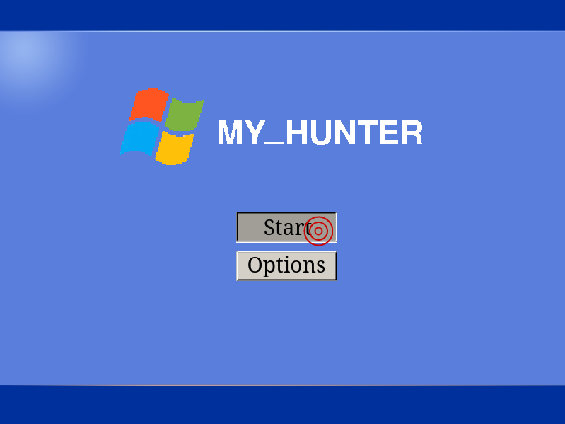

# MY_HUNTER

Small video game based on [Duck Hunt](https://en.wikipedia.org/wiki/Duck_Hunt) with Windows XP visuals.

- the player is a hunter who shoots ducks.
- ducks must appear on the screen and move from one side to another.
- the player can click on them to shoot them.

## Usage

```bash
$ make
$ ./my_hunter # sound on
```

## Gallery


