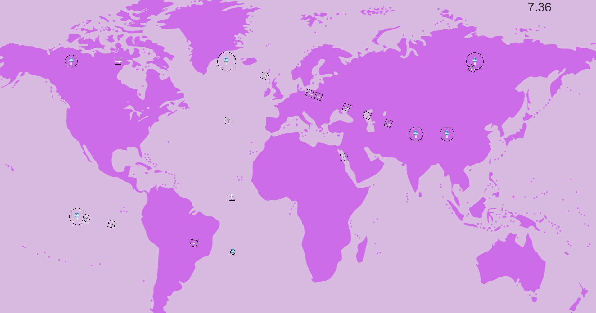

# MY_RADAR

2D visualization panel showing a simulation of air traffic (AT).

There are 2 types of entities:
- aircrafts,
- control towers.

The basic rules for the my_radar are as follows:
- aircrafts fly from given places to other ones.
- aircrafts appear on the simulation panel when they take off.
- aircrafts disappear from the simulation panel when they land on.
- aircrafts move in a straight line at given constant speeds.
- aircrafts colliding with another one is destroyed and disappear from the simulation panel.
- control areas allow aircrafts to collide with each other without being destroyed and they can continue on their way.
- control towers don’t move and have control areas on the map.
- control towers appear on the simulation panel at launch.



## Usage

```bash
# make
$ make

# help
$ ./my_radar -h

# example
$ ./my_radar test_files/100_planes_7_towers.rdr 
```
